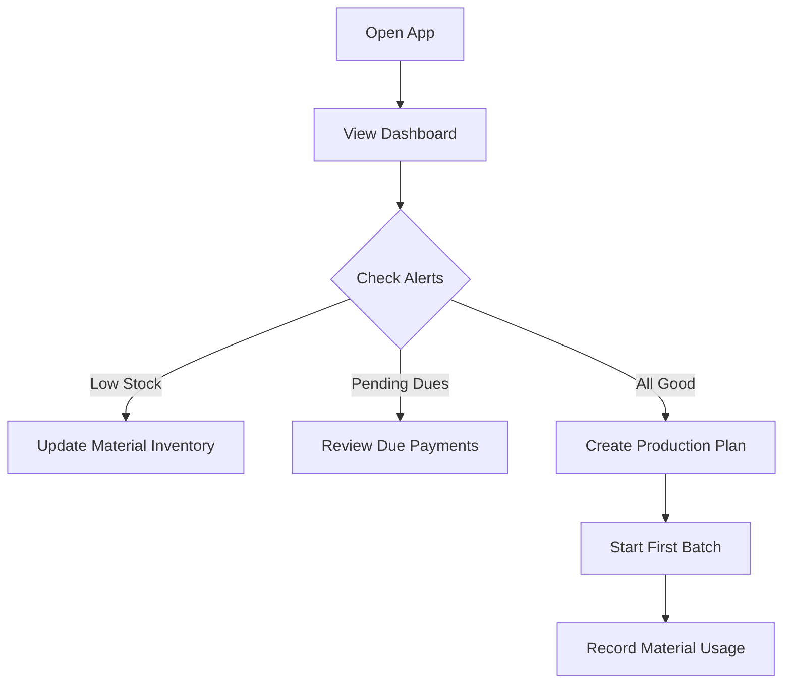
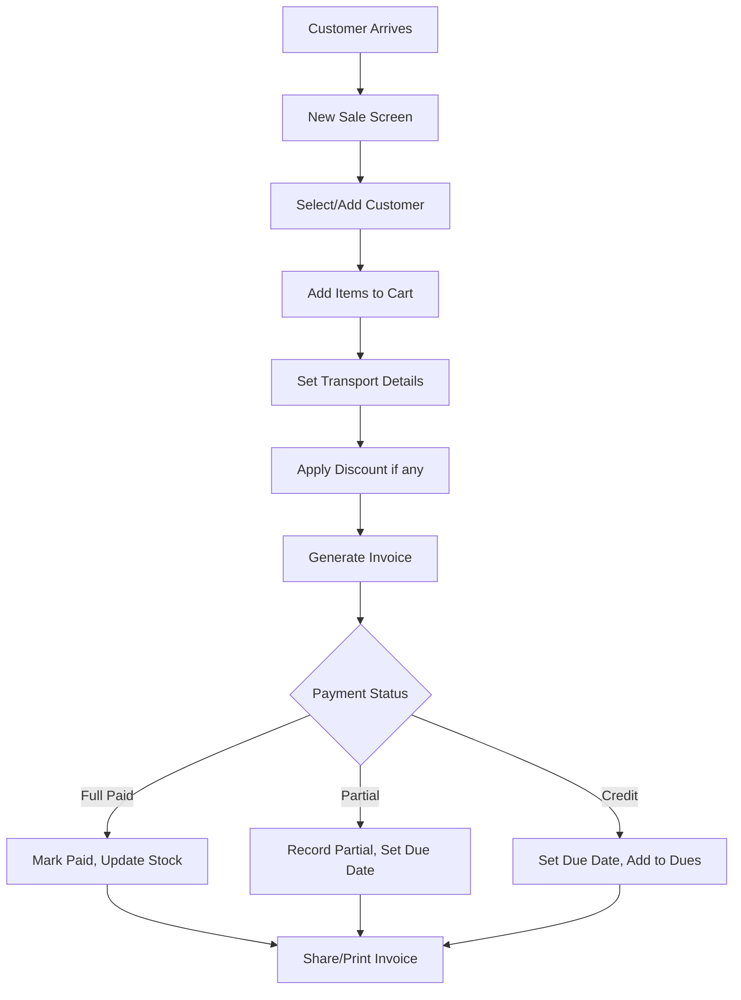
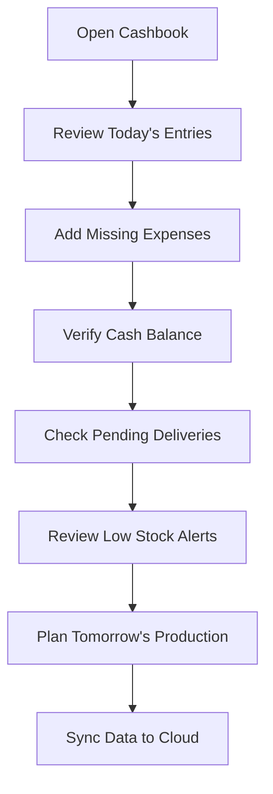

# Interlock Factory PWA - UX Workflow & Design Specification

## Table of Contents
1. [App Overview](#app-overview)
2. [User Personas](#user-personas)
3. [Navigation Structure](#navigation-structure)
4. [Screen-by-Screen Breakdown](#screen-by-screen-breakdown)
5. [User Flows](#user-flows)
6. [UI/UX Design Guidelines](#uiux-design-guidelines)
7. [Offline Behavior](#offline-behavior)

---

## App Overview

### App Identity
- **Name:** Smridhi BuildMart Factory Manager
- **Type:** Progressive Web App (PWA)
- **Theme:** Earth & Construction (Brick Red/Terracotta, Sand Beige, Dark Green)
- **Target Devices:** Mobile-first, responsive for tablets and desktop

### Core Value Proposition
A comprehensive factory management solution that works offline, enabling interlock block manufacturers to manage everything from raw materials to sales, billing, and analytics - all in one place.

---

## User Personas

### Primary User: Factory Owner
- Full access to all features
- Focus on dashboard analytics, financial reports, and oversight
- Needs quick access to daily revenue, expenses, and profit summary

### Secondary Users (Future scope):
- Factory Manager: Production & inventory focus
- Sales Staff: Billing & customer management
- Accountant: Payments & financial reports

---

## Navigation Structure

### Bottom Navigation Bar (Mobile)
```
┌─────────────────────────────────────────────────────────────┐
│  🏠 Home  │  📦 Inventory  │  ➕ Quick Add  │  💰 Sales  │  📊 Reports  │
└─────────────────────────────────────────────────────────────┘
```

### Hamburger Menu / Side Drawer
```
┌────────────────────────┐
│  👤 Profile            │
│  ─────────────────────│
│  🏠 Dashboard          │
│  📦 Inventory          │
│     ├── Raw Materials  │
│     ├── Blocks/Stock   │
│     └── Low Stock      │
│  🏭 Production         │
│     ├── Daily Plan     │
│     └── Batch Records  │
│  💰 Sales & Billing    │
│     ├── New Sale       │
│     ├── Invoices       │
│     └── Pending Dues   │
│  👥 Customers          │
│  💳 Payments           │
│     ├── Cashbook       │
│     └── Payment History│
│  🚚 Transport          │
│  📊 Reports            │
│  📄 Documents          │
│  ⚙️ Settings           │
│  ─────────────────────│
│  🔄 Sync Status        │
│  📤 Logout             │
└────────────────────────┘
```

---

## Screen-by-Screen Breakdown

### 1. Splash Screen
**Purpose:** Brand introduction & loading

**UI Elements:**
- Smridhi BuildMart logo (centered)
- Subtle loading animation
- App tagline: "Factory Management Made Simple"
- Auto-redirect to Dashboard or Login

**Duration:** 2-3 seconds

---

### 2. Login / Authentication Screen
**Purpose:** Secure access

**UI Elements:**
- Logo at top
- Phone number or email input
- Password / PIN input
- "Remember me" checkbox
- Login button (primary CTA)
- Forgot password link
- Biometric login option (fingerprint icon)

**UX Notes:**
- Show password toggle
- Clear error messages
- Loading state on submit

---

### 3. Dashboard (Home Screen)
**Purpose:** At-a-glance overview of factory operations

**Layout:**

```
┌─────────────────────────────────────────┐
│  Header: "Welcome, [Owner Name]"     🔔 │
│  Date: Today, Feb 10, 2026              │
├─────────────────────────────────────────┤
│                                         │
│  ┌─────────────────────────────────┐    │
│  │  💵 Today's Revenue             │    │
│  │  ₹ 45,200                       │    │
│  │  ↑ 12% from yesterday           │    │
│  └─────────────────────────────────┘    │
│                                         │
│  ┌────────────┐  ┌────────────┐         │
│  │ 📦 Stock   │  │ 🏭 Batches │         │
│  │   1,250    │  │     5      │         │
│  │  blocks    │  │   today    │         │
│  └────────────┘  └────────────┘         │
│                                         │
│  ┌────────────┐  ┌────────────┐         │
│  │ 💳 Pending │  │ 📉 Expenses│         │
│  │  ₹32,400   │  │  ₹8,200    │         │
│  │   dues     │  │   today    │         │
│  └────────────┘  └────────────┘         │
│                                         │
│  ┌─────────────────────────────────┐    │
│  │  🏆 In-Hand Amount Today        │    │
│  │  ₹ 37,000                       │    │
│  │  (Revenue - Expenses)           │    │
│  └─────────────────────────────────┘    │
│                                         │
├─────────────────────────────────────────┤
│  📊 Quick Stats                         │
│  ┌─────────────────────────────────┐    │
│  │ Top Selling: Grey 6x8 Pavers    │    │
│  │ Low Stock Alert: Cement (3 bags)│    │
│  │ Pending Deliveries: 2           │    │
│  └─────────────────────────────────┘    │
│                                         │
├─────────────────────────────────────────┤
│  ⏰ Recent Activity                     │
│  • Sale #INV-2024 - ₹8,500 (10:30 AM)  │
│  • Batch #B-145 completed (9:15 AM)    │
│  • Payment received - ₹5,000 (8:45 AM) │
│  [View All →]                           │
└─────────────────────────────────────────┘
```

**Interactive Elements:**
- Each card is tappable → navigates to detailed view
- Pull-to-refresh for data sync
- Notification bell shows pending alerts

---

### 4. Raw Material Management

#### 4.1 Material List Screen
**Purpose:** View all raw materials inventory

```
┌─────────────────────────────────────────┐
│  ← Raw Materials                    ➕  │
├─────────────────────────────────────────┤
│  🔍 Search materials...                 │
├─────────────────────────────────────────┤
│  Filter: [All ▼] [Low Stock] [In Stock] │
├─────────────────────────────────────────┤
│                                         │
│  ┌─────────────────────────────────┐    │
│  │ 🧱 Cement                       │    │
│  │    Stock: 45 bags               │    │
│  │    ⚠️ Low Stock Alert           │    │
│  │    Last updated: 2 hrs ago      │    │
│  └─────────────────────────────────┘    │
│                                         │
│  ┌─────────────────────────────────┐    │
│  │ 🏖️ Sand                        │    │
│  │    Stock: 12 tons               │    │
│  │    ✅ Good                       │    │
│  │    Last updated: 1 hr ago       │    │
│  └─────────────────────────────────┘    │
│                                         │
│  ┌─────────────────────────────────┐    │
│  │ 🪨 Aggregate (10mm)             │    │
│  │    Stock: 8 tons                │    │
│  │    ✅ Good                       │    │
│  │    Last updated: 3 hrs ago      │    │
│  └─────────────────────────────────┘    │
│                                         │
│  ┌─────────────────────────────────┐    │
│  │ 🎨 Red Color                    │    │
│  │    Stock: 25 kg                 │    │
│  │    ✅ Good                       │    │
│  │    Last updated: Yesterday      │    │
│  └─────────────────────────────────┘    │
│                                         │
└─────────────────────────────────────────┘
```

#### 4.2 Add/Edit Material Screen
**Purpose:** Add new material or update stock

**Form Fields:**
- Material Name (text input)
- Category (dropdown: Cement, Sand, Aggregate, Color, Other)
- Unit (dropdown: bags, kg, tons)
- Current Stock (number input)
- Minimum Stock Level (for alerts)
- Notes (optional text area)

**Action Buttons:**
- Save (primary)
- Cancel (secondary)

---

### 5. Production Management

#### 5.1 Production Overview
```
┌─────────────────────────────────────────┐
│  ← Production                       ➕  │
├─────────────────────────────────────────┤
│  ┌────────────────┐ ┌────────────────┐  │
│  │ Today's Plan   │ │ Batch Records  │  │
│  └────────────────┘ └────────────────┘  │
├─────────────────────────────────────────┤
│  📅 Today's Production Summary          │
│  ┌─────────────────────────────────┐    │
│  │ Planned: 500 blocks             │    │
│  │ Completed: 380 blocks           │    │
│  │ Remaining: 120 blocks           │    │
│  │ [████████░░░░] 76%              │    │
│  └─────────────────────────────────┘    │
├─────────────────────────────────────────┤
│  🏭 Active Batches                      │
│  ┌─────────────────────────────────┐    │
│  │ Batch #B-146 | Grey 6x8         │    │
│  │ Started: 11:00 AM               │    │
│  │ Target: 100 blocks              │    │
│  │ Status: 🟡 In Progress          │    │
│  │ [Mark Complete]                 │    │
│  └─────────────────────────────────┘    │
│                                         │
│  ┌─────────────────────────────────┐    │
│  │ Batch #B-145 | Red Pavers       │    │
│  │ Completed: 9:15 AM              │    │
│  │ Produced: 95 blocks (5 defects) │    │
│  │ Status: ✅ Complete              │    │
│  └─────────────────────────────────┘    │
└─────────────────────────────────────────┘
```

#### 5.2 New Batch Entry Screen
**Form Fields:**
- Batch Number (auto-generated)
- Block Type (dropdown with search)
- Target Quantity
- Materials Used:
  - Cement (bags)
  - Sand (tons/kg)
  - Aggregate (tons/kg)
  - Color (kg) - if applicable
- Start Time
- Notes

**Upon Completion:**
- Actual quantity produced
- Defective/damaged count
- End time

---

### 6. Block & Inventory Management

#### 6.1 Block Inventory List
```
┌─────────────────────────────────────────┐
│  ← Block Inventory                  ➕  │
├─────────────────────────────────────────┤
│  🔍 Search blocks...                    │
├─────────────────────────────────────────┤
│  Category: [All ▼] [Pavers][Bricks][..] │
│  Status: [All] [Available] [Reserved]   │
├─────────────────────────────────────────┤
│                                         │
│  ┌─────────────────────────────────┐    │
│  │ 🧱 Grey Paver 6x8"              │    │
│  │    Available: 450 units         │    │
│  │    Reserved: 50 units           │    │
│  │    Price: ₹12/unit              │    │
│  │    [View] [Stock In] [Stock Out]│    │
│  └─────────────────────────────────┘    │
│                                         │
│  ┌─────────────────────────────────┐    │
│  │ 🧱 Red Paver 8x8"               │    │
│  │    Available: 280 units         │    │
│  │    Reserved: 0 units            │    │
│  │    Price: ₹15/unit              │    │
│  │    [View] [Stock In] [Stock Out]│    │
│  └─────────────────────────────────┘    │
│                                         │
│  ┌─────────────────────────────────┐    │
│  │ 🧱 Designer Tiles - Zigzag      │    │
│  │    Available: 120 units         │    │
│  │    Reserved: 30 units           │    │
│  │    Price: ₹25/unit              │    │
│  │    [View] [Stock In] [Stock Out]│    │
│  └─────────────────────────────────┘    │
│                                         │
└─────────────────────────────────────────┘
```

#### 6.2 Block Detail & Stock Movement
**Shows:**
- Block image
- Specifications (size, color, category)
- Total stock with breakdown
- Stock aging (days in inventory)
- Recent movements (in/out history)
- Related sales

---

### 7. Sales & Billing

#### 7.1 Sales List Screen
```
┌─────────────────────────────────────────┐
│  ← Sales & Invoices                 ➕  │
├─────────────────────────────────────────┤
│  🔍 Search sales...                     │
├─────────────────────────────────────────┤
│  📅 [Today ▼]  Status: [All ▼]          │
├─────────────────────────────────────────┤
│                                         │
│  ┌─────────────────────────────────┐    │
│  │ 📄 INV-2024-0156               │    │
│  │    Customer: Raj Construction   │    │
│  │    Amount: ₹24,500              │    │
│  │    Status: 🟢 Paid               │    │
│  │    Date: Feb 10, 2026           │    │
│  │    [View Invoice]               │    │
│  └─────────────────────────────────┘    │
│                                         │
│  ┌─────────────────────────────────┐    │
│  │ 📄 INV-2024-0155               │    │
│  │    Customer: ABC Builders       │    │
│  │    Amount: ₹18,200              │    │
│  │    Status: 🟡 Partial (₹10,000) │    │
│  │    Date: Feb 9, 2026            │    │
│  │    [View Invoice] [Record Pay]  │    │
│  └─────────────────────────────────┘    │
│                                         │
│  ┌─────────────────────────────────┐    │
│  │ 📄 INV-2024-0154               │    │
│  │    Customer: Local Customer     │    │
│  │    Amount: ₹3,500               │    │
│  │    Status: 🔴 Pending           │    │
│  │    Due: Feb 15, 2026            │    │
│  │    [View Invoice] [Record Pay]  │    │
│  └─────────────────────────────────┘    │
│                                         │
└─────────────────────────────────────────┘
```

#### 7.2 New Sale / Invoice Creation
```
┌─────────────────────────────────────────┐
│  ← New Sale                         ✖️  │
├─────────────────────────────────────────┤
│  CUSTOMER                               │
│  ┌─────────────────────────────────┐    │
│  │ 🔍 Select or Add Customer       │    │
│  │    [Raj Construction ▼]         │    │
│  │    + Add New Customer           │    │
│  └─────────────────────────────────┘    │
│                                         │
│  INVOICE TYPE                           │
│  ○ GST Invoice  ● Non-GST              │
├─────────────────────────────────────────┤
│  ITEMS                                  │
│  ┌─────────────────────────────────┐    │
│  │ Grey Paver 6x8"                 │    │
│  │ Qty: [100    ] Rate: ₹12       │    │
│  │ Amount: ₹1,200          [🗑️]   │    │
│  └─────────────────────────────────┘    │
│                                         │
│  ┌─────────────────────────────────┐    │
│  │ Red Paver 8x8"                  │    │
│  │ Qty: [50     ] Rate: ₹15       │    │
│  │ Amount: ₹750            [🗑️]   │    │
│  └─────────────────────────────────┘    │
│                                         │
│  [+ Add Item]                           │
├─────────────────────────────────────────┤
│  TRANSPORT                              │
│  ┌─────────────────────────────────┐    │
│  │ Vehicle: [Select Vehicle ▼]     │    │
│  │ Transport Cost: ₹[500      ]    │    │
│  └─────────────────────────────────┘    │
├─────────────────────────────────────────┤
│  SUMMARY                                │
│  ┌─────────────────────────────────┐    │
│  │ Subtotal:         ₹1,950        │    │
│  │ Transport:        ₹500          │    │
│  │ GST (18%):        ₹0            │    │
│  │ ─────────────────────────────   │    │
│  │ TOTAL:            ₹2,450        │    │
│  └─────────────────────────────────┘    │
├─────────────────────────────────────────┤
│  PAYMENT                                │
│  ┌─────────────────────────────────┐    │
│  │ Payment Status:                 │    │
│  │ ○ Full Paid ○ Partial ● Credit  │    │
│  │                                 │    │
│  │ Amount Received: ₹[0       ]    │    │
│  │ Payment Mode: [Cash ▼]          │    │
│  │ Due Date: [Feb 25, 2026  📅]    │    │
│  └─────────────────────────────────┘    │
├─────────────────────────────────────────┤
│  [Generate Invoice]                     │
│  [Save as Draft]                        │
└─────────────────────────────────────────┘
```

#### 7.3 Invoice Preview / PDF View
- Full invoice layout with company header
- Customer details
- Itemized list with quantities and rates
- Transport charges
- Tax breakdown (if GST)
- Total amount
- Payment status
- Digital signature placeholder
- Share/Download/Print options

---

### 8. Customer Management

#### 8.1 Customer List
```
┌─────────────────────────────────────────┐
│  ← Customers                        ➕  │
├─────────────────────────────────────────┤
│  🔍 Search customers...                 │
├─────────────────────────────────────────┤
│  Filter: [All ▼] [With Dues] [GST]      │
├─────────────────────────────────────────┤
│                                         │
│  ┌─────────────────────────────────┐    │
│  │ 🏢 Raj Construction            │    │
│  │    📞 9876543210                │    │
│  │    Total Business: ₹2,45,000    │    │
│  │    Pending Due: ₹0              │    │
│  │    Type: GST Registered         │    │
│  └─────────────────────────────────┘    │
│                                         │
│  ┌─────────────────────────────────┐    │
│  │ 🏗️ ABC Builders                │    │
│  │    📞 9876543211                │    │
│  │    Total Business: ₹1,80,000    │    │
│  │    Pending Due: ₹8,200 ⚠️       │    │
│  │    Type: Non-GST                │    │
│  └─────────────────────────────────┘    │
│                                         │
└─────────────────────────────────────────┘
```

#### 8.2 Customer Detail Screen
**Shows:**
- Customer info (name, phone, address, GST number)
- Total purchase history value
- Pending dues with due dates
- Purchase history timeline
- Payment history
- Credit limit (if set)

**Actions:**
- Edit customer
- Call customer
- Record payment
- Create new sale

---

### 9. Payments & Accounting

#### 9.1 Daily Cashbook
```
┌─────────────────────────────────────────┐
│  ← Daily Cashbook                   📤  │
├─────────────────────────────────────────┤
│  📅 [Feb 10, 2026 ▼]                    │
├─────────────────────────────────────────┤
│  ┌─────────────────────────────────┐    │
│  │ 💰 Opening Balance              │    │
│  │    ₹25,000                      │    │
│  └─────────────────────────────────┘    │
├─────────────────────────────────────────┤
│  📥 RECEIPTS (Revenue)                  │
│  ┌─────────────────────────────────┐    │
│  │ INV-156 - Raj Construction      │    │
│  │ Cash              +₹24,500      │    │
│  ├─────────────────────────────────┤    │
│  │ INV-155 - ABC Builders          │    │
│  │ UPI               +₹10,000      │    │
│  ├─────────────────────────────────┤    │
│  │ INV-150 - Payment Received      │    │
│  │ Bank              +₹15,000      │    │
│  └─────────────────────────────────┘    │
│  Total Receipts:         +₹49,500      │
├─────────────────────────────────────────┤
│  📤 PAYMENTS (Expenses)                 │
│  ┌─────────────────────────────────┐    │
│  │ Material - Cement Purchase      │    │
│  │ Bank               -₹15,000     │    │
│  ├─────────────────────────────────┤    │
│  │ Transport - Vehicle Fuel        │    │
│  │ Cash               -₹2,500      │    │
│  ├─────────────────────────────────┤    │
│  │ Other - Electricity Bill        │    │
│  │ UPI                -₹3,200      │    │
│  └─────────────────────────────────┘    │
│  Total Payments:         -₹20,700      │
├─────────────────────────────────────────┤
│  ┌─────────────────────────────────┐    │
│  │ 💵 In-Hand Today                │    │
│  │    ₹53,800                      │    │
│  │    (Opening + Revenue - Expense)│    │
│  └─────────────────────────────────┘    │
├─────────────────────────────────────────┤
│  [+ Add Revenue] [+ Add Expense]        │
└─────────────────────────────────────────┘
```

#### 9.2 Add Expense Entry
**Form Fields:**
- Expense Category (Material, Transport, Salary, Utility, Other)
- Description
- Amount
- Payment Mode (Cash / UPI / Bank)
- Receipt Image (optional - camera/gallery)
- Date
- Notes

---

### 10. Transport & Delivery

#### 10.1 Vehicle Management
```
┌─────────────────────────────────────────┐
│  ← Transport                        ➕  │
├─────────────────────────────────────────┤
│  🚛 VEHICLES                            │
│  ┌─────────────────────────────────┐    │
│  │ 🚚 Tata 407 - MH12AB1234        │    │
│  │    Status: 🟢 Available          │    │
│  │    Today's Trips: 3              │    │
│  │    [View History]                │    │
│  └─────────────────────────────────┘    │
│                                         │
│  ┌─────────────────────────────────┐    │
│  │ 🛻 Pickup - MH12CD5678          │    │
│  │    Status: 🟡 On Delivery        │    │
│  │    Current: INV-156 Delivery    │    │
│  │    [Track]                       │    │
│  └─────────────────────────────────┘    │
├─────────────────────────────────────────┤
│  📦 PENDING DELIVERIES                  │
│  ┌─────────────────────────────────┐    │
│  │ INV-2024-0154 - Local Customer  │    │
│  │ Items: Grey Paver x 200         │    │
│  │ Address: 123 Main Road          │    │
│  │ [Assign Vehicle] [Mark Delivered]│   │
│  └─────────────────────────────────┘    │
└─────────────────────────────────────────┘
```

---

### 11. Reports & Analytics

#### 11.1 Reports Home
```
┌─────────────────────────────────────────┐
│  ← Reports & Analytics                  │
├─────────────────────────────────────────┤
│                                         │
│  ┌─────────────────────────────────┐    │
│  │ 📈 Profit & Loss               →│    │
│  │    Overview of revenue & costs   │    │
│  └─────────────────────────────────┘    │
│                                         │
│  ┌─────────────────────────────────┐    │
│  │ 📊 Sales Report                →│    │
│  │    Daily, weekly, monthly sales  │    │
│  └─────────────────────────────────┘    │
│                                         │
│  ┌─────────────────────────────────┐    │
│  │ 📦 Production Report           →│    │
│  │    Batch-wise production data    │    │
│  └─────────────────────────────────┘    │
│                                         │
│  ┌─────────────────────────────────┐    │
│  │ 🧱 Material Usage Trends       →│    │
│  │    Consumption patterns          │    │
│  └─────────────────────────────────┘    │
│                                         │
│  ┌─────────────────────────────────┐    │
│  │ 🏆 Best Selling Blocks         →│    │
│  │    Top products by volume        │    │
│  └─────────────────────────────────┘    │
│                                         │
│  ┌─────────────────────────────────┐    │
│  │ 💳 Pending Dues Report         →│    │
│  │    Outstanding payments          │    │
│  └─────────────────────────────────┘    │
│                                         │
│  ┌─────────────────────────────────┐    │
│  │ 📤 Export Data                 →│    │
│  │    Download PDF / Excel          │    │
│  └─────────────────────────────────┘    │
│                                         │
└─────────────────────────────────────────┘
```

#### 11.2 Profit & Loss Report
```
┌─────────────────────────────────────────┐
│  ← Profit & Loss                   📤   │
├─────────────────────────────────────────┤
│  Period: [This Month ▼]                 │
├─────────────────────────────────────────┤
│                                         │
│  ┌─────────────────────────────────┐    │
│  │ 📈 REVENUE                      │    │
│  │    Sales:           ₹4,85,000   │    │
│  │    Transport:       ₹25,000     │    │
│  │    ─────────────────────────   │    │
│  │    Total Revenue:   ₹5,10,000   │    │
│  └─────────────────────────────────┘    │
│                                         │
│  ┌─────────────────────────────────┐    │
│  │ 📉 EXPENSES                     │    │
│  │    Materials:       ₹1,80,000   │    │
│  │    Labor:           ₹45,000     │    │
│  │    Transport:       ₹18,000     │    │
│  │    Utilities:       ₹12,000     │    │
│  │    Other:           ₹8,500      │    │
│  │    ─────────────────────────   │    │
│  │    Total Expenses:  ₹2,63,500   │    │
│  └─────────────────────────────────┘    │
│                                         │
│  ┌─────────────────────────────────┐    │
│  │ 💰 NET PROFIT                   │    │
│  │    ₹2,46,500                    │    │
│  │    Margin: 48.3%                │    │
│  └─────────────────────────────────┘    │
│                                         │
│  [📊 Chart] [📋 Detailed]               │
│                                         │
└─────────────────────────────────────────┘
```

---

### 12. Settings

```
┌─────────────────────────────────────────┐
│  ← Settings                             │
├─────────────────────────────────────────┤
│  BUSINESS PROFILE                       │
│  ┌─────────────────────────────────┐    │
│  │ 🏭 Factory Details             →│    │
│  │ 📄 GST Information             →│    │
│  │ 🏦 Bank Details                →│    │
│  │ 📱 Invoice Header              →│    │
│  └─────────────────────────────────┘    │
│                                         │
│  INVENTORY SETTINGS                     │
│  ┌─────────────────────────────────┐    │
│  │ 🧱 Block Types & Pricing       →│    │
│  │ 📦 Low Stock Thresholds        →│    │
│  │ 🎨 Material Categories         →│    │
│  └─────────────────────────────────┘    │
│                                         │
│  APP PREFERENCES                        │
│  ┌─────────────────────────────────┐    │
│  │ 🌙 Dark Mode           [Toggle] │    │
│  │ 🔔 Notifications       [Toggle] │    │
│  │ 🔐 Biometric Login     [Toggle] │    │
│  │ 🌐 Language             [Hindi]→│    │
│  └─────────────────────────────────┘    │
│                                         │
│  DATA & SYNC                            │
│  ┌─────────────────────────────────┐    │
│  │ 🔄 Sync Status: ✅ Up to date    │    │
│  │ 📤 Export All Data              →│    │
│  │ 📥 Import Data                  →│    │
│  │ 🗑️ Clear Local Cache            →│    │
│  └─────────────────────────────────┘    │
│                                         │
│  [🚪 Logout]                            │
│                                         │
└─────────────────────────────────────────┘
```

---

## User Flows

### Flow 1: Daily Morning Routine


### Flow 2: Complete Sale Process


### Flow 3: End of Day Reconciliation


---

## UI/UX Design Guidelines

### Color Palette (Earth & Construction Theme)
```
Primary:     #A0522D (Brick Red/Terracotta)
Secondary:   #D4B896 (Sand Beige)
Accent:      #2E5933 (Dark Green)
Background:  #FAF6F1 (Warm Off-White)
Surface:     #FFFFFF (White)
Text Primary:#2D2D2D (Dark Grey)
Text Secondary: #666666 (Medium Grey)
Success:     #4CAF50 (Green)
Warning:     #FFA726 (Orange)
Error:       #EF5350 (Red)
```

### Typography
- **Headings:** Inter Bold / Outfit Semibold
- **Body:** Inter Regular
- **Numbers/Amounts:** Roboto Mono (for alignment)
- **Size Scale:** 12px, 14px, 16px, 18px, 24px, 32px

### Component Styles
- **Cards:** Soft shadows, 12px border-radius
- **Buttons:** Rounded (8px), filled primary, outlined secondary
- **Inputs:** Bordered, focus ring in primary color
- **Bottom Nav:** Fixed, 60px height, icons + labels

### Micro-interactions
- Button press: Slight scale down (0.95)
- Card tap: Ripple effect
- Loading: Skeleton screens
- Success: Checkmark animation
- Swipe actions: Delete (red), Edit (blue)

### Accessibility
- Minimum touch target: 48x48px
- Color contrast: AA compliant
- Font scaling support
- Screen reader labels

---

## Offline Behavior

### Data Storage Strategy
| Data Type | Storage | Sync Priority |
|-----------|---------|---------------|
| User settings | IndexedDB | On change |
| Material inventory | IndexedDB | High |
| Block stock | IndexedDB | High |
| Sales/Invoices | IndexedDB | High |
| Customer data | IndexedDB | Medium |
| Production batches | IndexedDB | High |
| Pending uploads (images) | Cache API | When online |
| Reports data | Generated locally | On demand |

### Offline Indicators
```
┌─────────────────────────────────────────┐
│  📴 You're offline                      │
│  Changes saved locally. Will sync when  │
│  connection is restored.                │
│  [Dismiss]                              │
└─────────────────────────────────────────┘
```

### Sync Badge on Nav
- Green dot: Synced
- Yellow dot: Syncing
- Red dot: Pending changes (count)

---

## Quick Action Floating Button (FAB)

On main screens, a FAB provides quick access to primary actions:

```
     ╭─────────╮
     │  ➕     │
     ╰────┬────╯
          │
    ╭─────┴─────╮
    │           │
┌───▼───┐  ┌───▼───┐
│New Sale│  │ Batch │
└────────┘  └───────┘
    │           │
┌───▼───┐  ┌───▼───┐
│Expense │  │ Stock │
└────────┘  └───────┘
```

---

## Summary of Screens

| # | Screen | Purpose |
|---|--------|---------|
| 1 | Splash | Loading & branding |
| 2 | Login | Authentication |
| 3 | Dashboard | Overview & KPIs |
| 4 | Material List | Raw material inventory |
| 5 | Add/Edit Material | Material CRUD |
| 6 | Production Overview | Daily production status |
| 7 | New Batch | Create production batch |
| 8 | Block Inventory | Finished goods stock |
| 9 | Block Detail | Stock movements |
| 10 | Sales List | All invoices |
| 11 | New Sale | Create invoice |
| 12 | Invoice Preview | PDF view |
| 13 | Customer List | CRM |
| 14 | Customer Detail | Customer profile |
| 15 | Daily Cashbook | Financial entries |
| 16 | Add Expense | Record expenses |
| 17 | Transport | Vehicle & delivery management |
| 18 | Reports Home | Analytics menu |
| 19 | P&L Report | Profit/loss statement |
| 20 | Settings | App configuration |

---

## Next Steps

1. **Design Phase:** Create high-fidelity mockups in Figma/Stitch
2. **Technical Setup:** Initialize React/Next.js PWA project
3. **Backend Setup:** Configure Supabase tables & authentication
4. **Development:** Build screens iteratively starting with Dashboard
5. **Testing:** Offline functionality & sync testing
6. **Deployment:** PWA hosting with service worker

---

*Document Version: 1.0*
*Last Updated: Feb 10, 2026*
